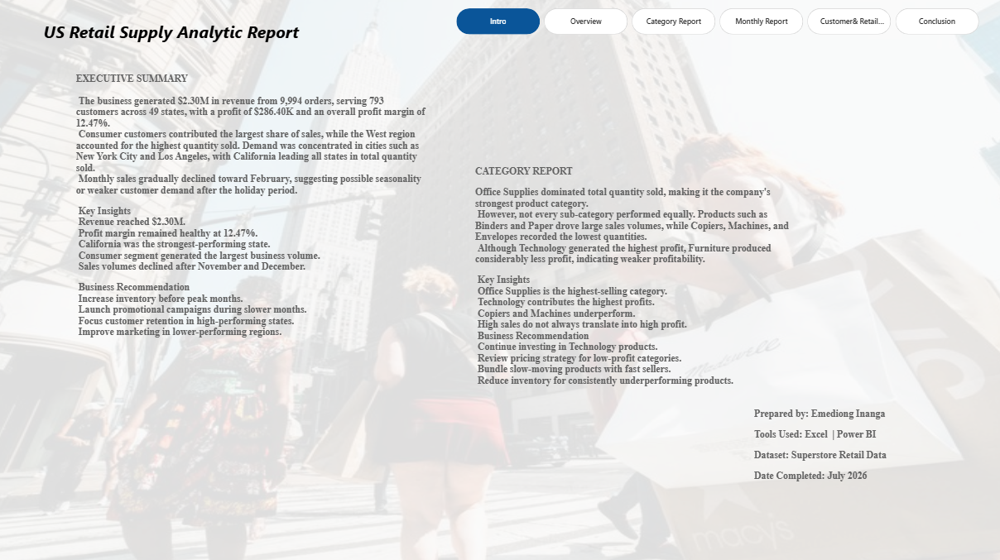
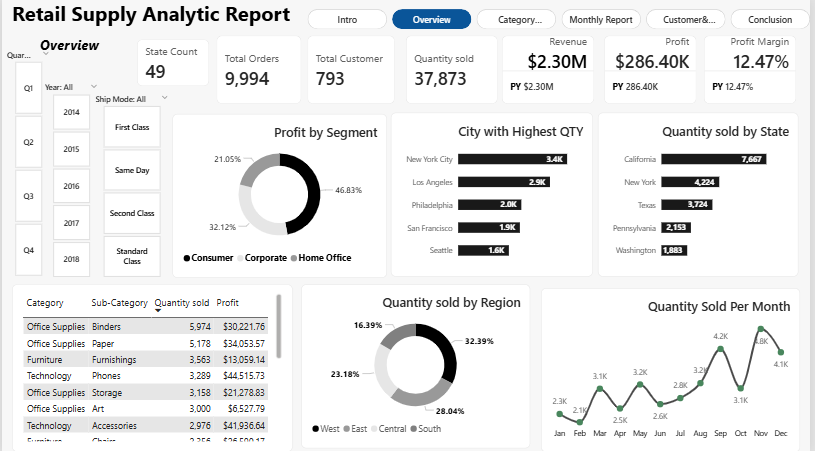
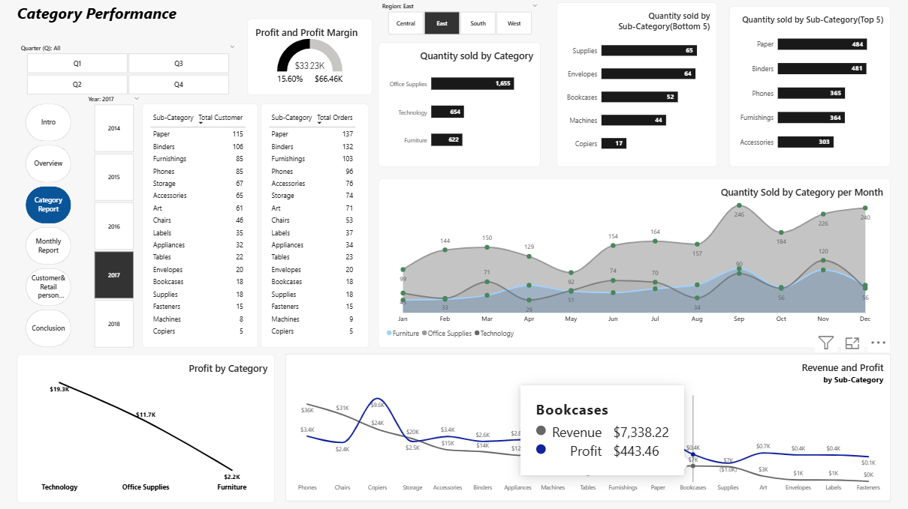
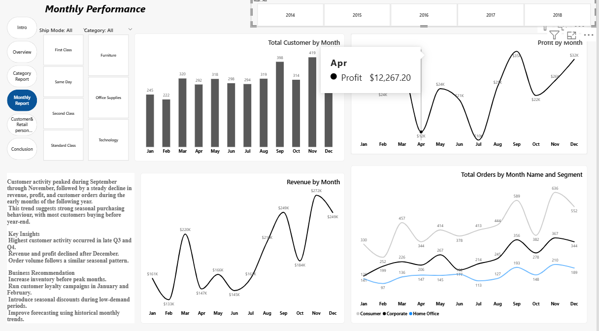
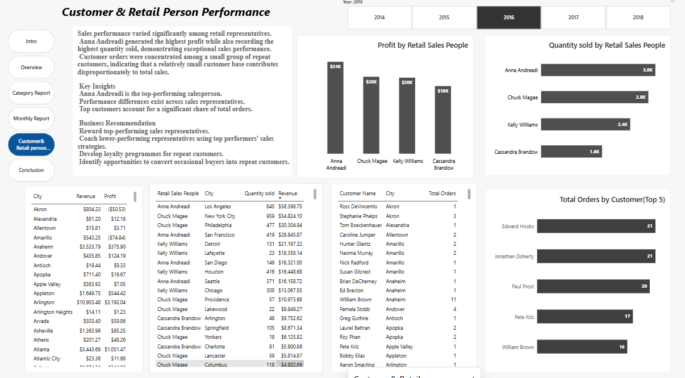
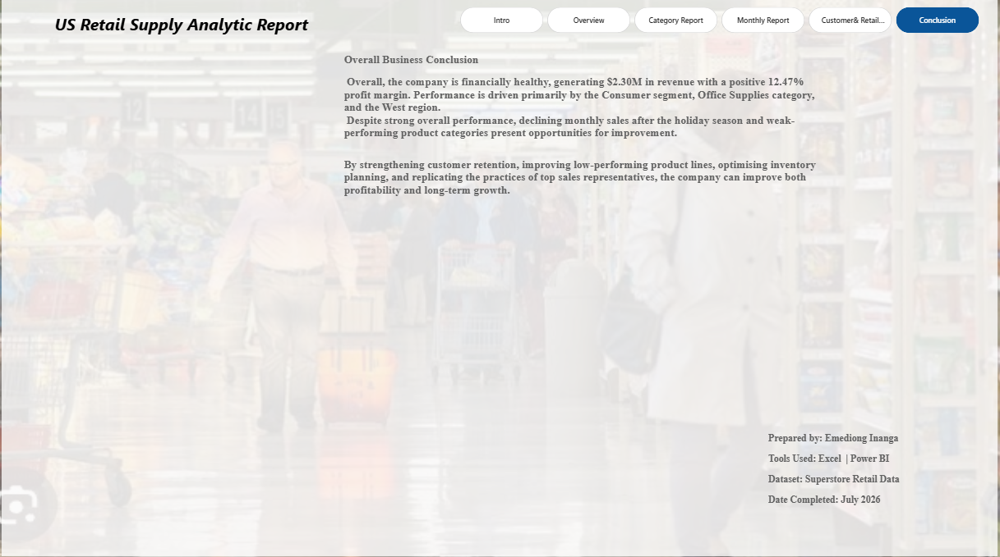

# Retail-Supply-Analytics-Dashboard-Power-BI-

## Overview

This project presents an interactive Power BI dashboard analysing retail supply performance between **2014 and 2017**. The objective is to transform raw retail sales data into meaningful business insights that support strategic decision-making.

The dashboard explores sales performance, profitability, customer behaviour, product categories, regional performance, and seasonal trends while providing actionable recommendations for business growth.

---

# Project Objectives

The dashboard was developed to answer the following business questions:

- How much revenue and profit did the business generate?
- Which regions and states contributed the most sales?
- Which product categories performed best?
- How do sales change throughout the year?
- Who are the top-performing customers and sales representatives?
- What opportunities exist to improve profitability?

---

# Dashboard Pages

### 1. Executive Summary

Provides an overview of the project, business objectives, and key findings.

---

### 2. Overview Dashboard

Highlights the company's key performance indicators, including:

- Total Revenue
- Total Profit
- Profit Margin
- Total Orders
- Total Customers
- Total States
- Regional Performance
- Shipping Analysis

---

### 3. Category Report

Analyses product performance by:

- Category
- Sub-category
- Quantity Sold
- Profit Contribution

---

### 4. Monthly Report

Examines business performance over time using:

- Monthly Revenue
- Monthly Profit
- Monthly Orders
- Monthly Sales Trend
- Seasonal Demand Patterns

---

### 5. Customer & Retail Person Report

Evaluates performance by:

- Customer
- Sales Representative
- Monthly Profit
- Monthly Orders

---

### 6. Conclusion & Recommendations

Summarises the key findings and presents practical business recommendations based on the analysis.

---

# Key Insights

- Generated **$2.30M** in total revenue.
- Achieved **$286.40K** profit with a **12.47%** profit margin.
- Processed approximately **10,000 orders** from **793 customers**.
- California recorded the highest sales volume.
- Sales peaked during **September–November**, indicating strong seasonal demand.
- Office Supplies generated the highest sales volume.
- Consumer customers contributed the largest share of sales.

---

# Business Recommendations

- Optimise shipping strategies to improve profitability.
- Increase inventory before seasonal demand peaks.
- Invest more in high-performing regions.
- Expand marketing efforts into emerging markets.
- Focus on high-margin product categories.
- Strengthen customer retention programmes.

---

# Tools Used

- Microsoft Excel
- Power BI
- Power Query
- DAX

---

# Skills Demonstrated

- Data Cleaning
- Data Transformation
- Data Modelling
- DAX Calculations
- Interactive Dashboard Design
- KPI Development
- Business Intelligence
- Data Visualisation
- Business Storytelling

---

# Dashboard Preview

## Executive Summary

---

## Overview Dashboard

---

## Category Report

---

## Monthly Report

---

## Customer & Retail Person Report

---

## Conclusion & Recommendations

---

# Author

## Emediong Inanga

Data Analyst with experience building interactive Power BI dashboards that transform raw business data into actionable insights.

Skilled in:
- Microsoft Excel
- Power BI
- Power Query
- DAX
- Data Cleaning
- Data Modelling
- Business Intelligence
- Data Visualisation
- Business Storytelling

This project demonstrates an end-to-end analytics workflow—from data preparation and transformation to dashboard development and business recommendations.
